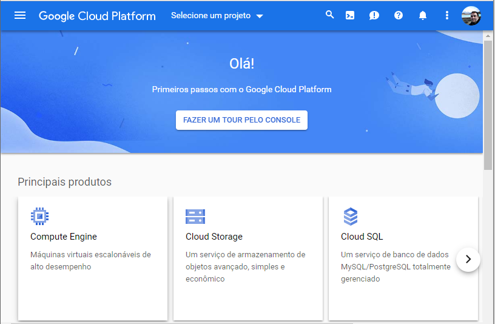
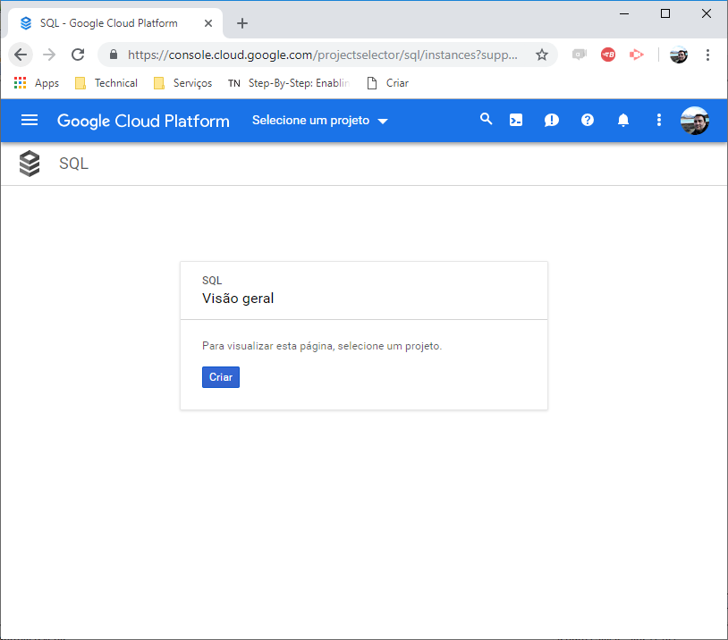
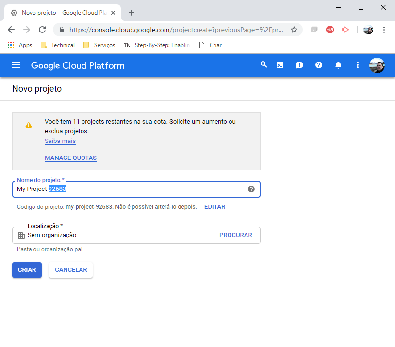
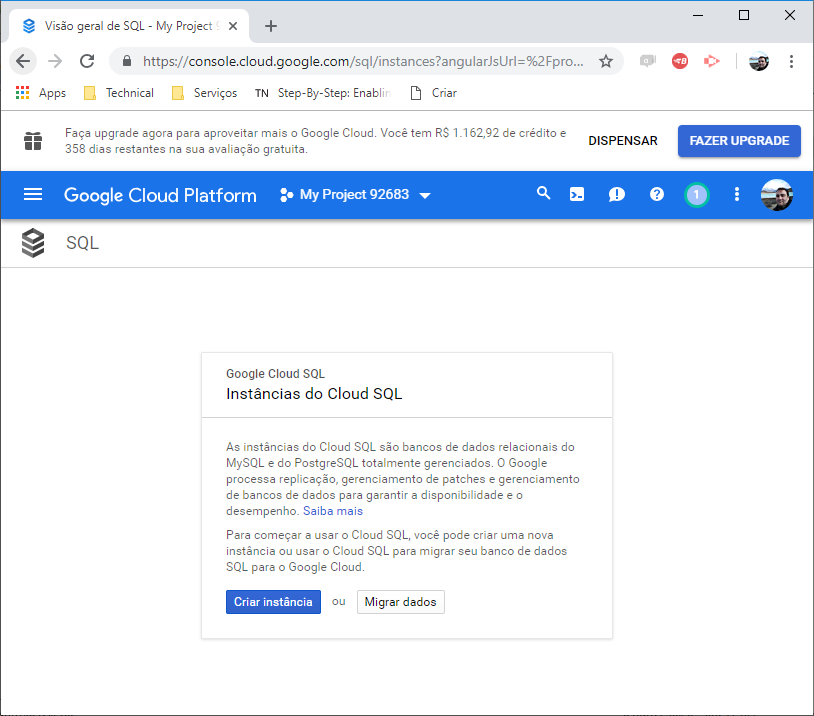
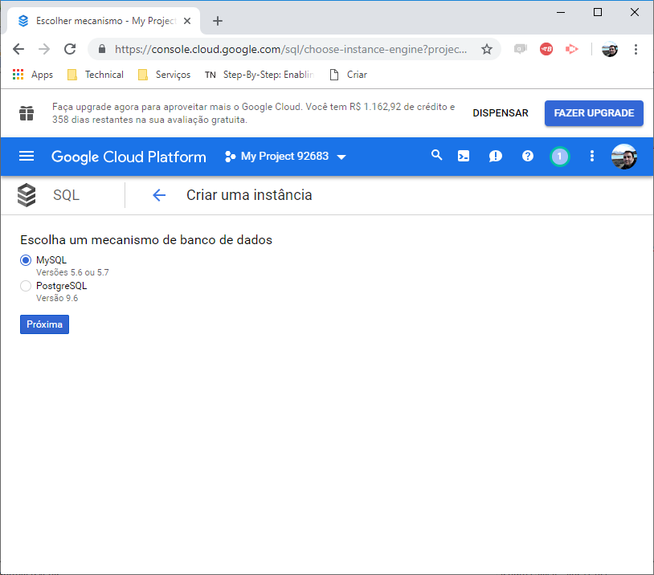
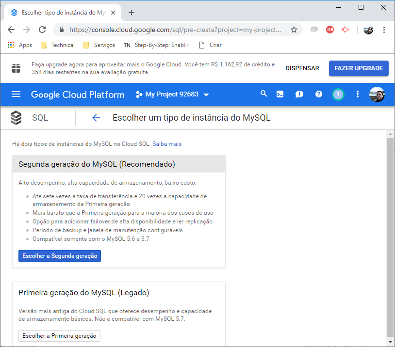
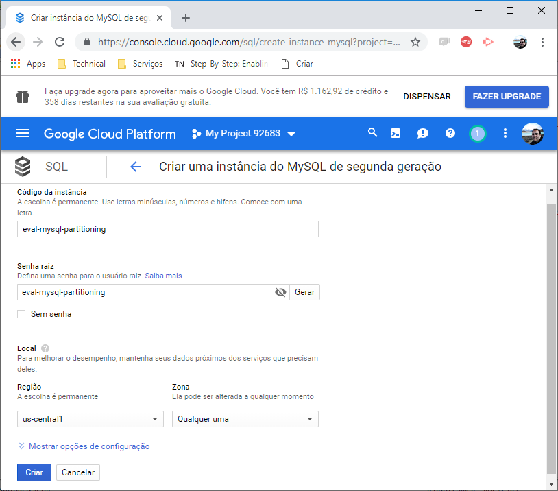
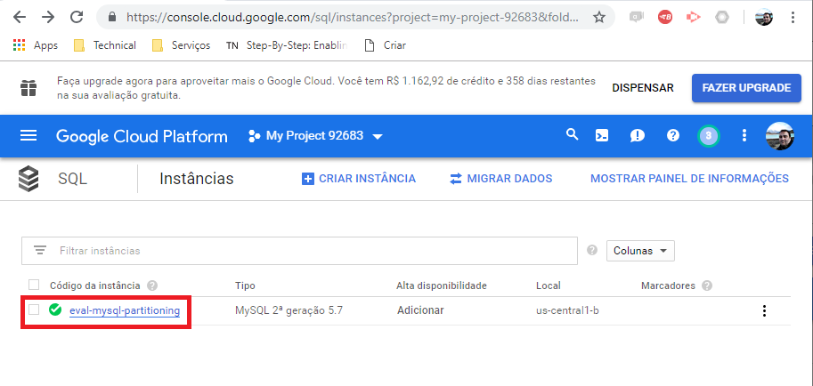
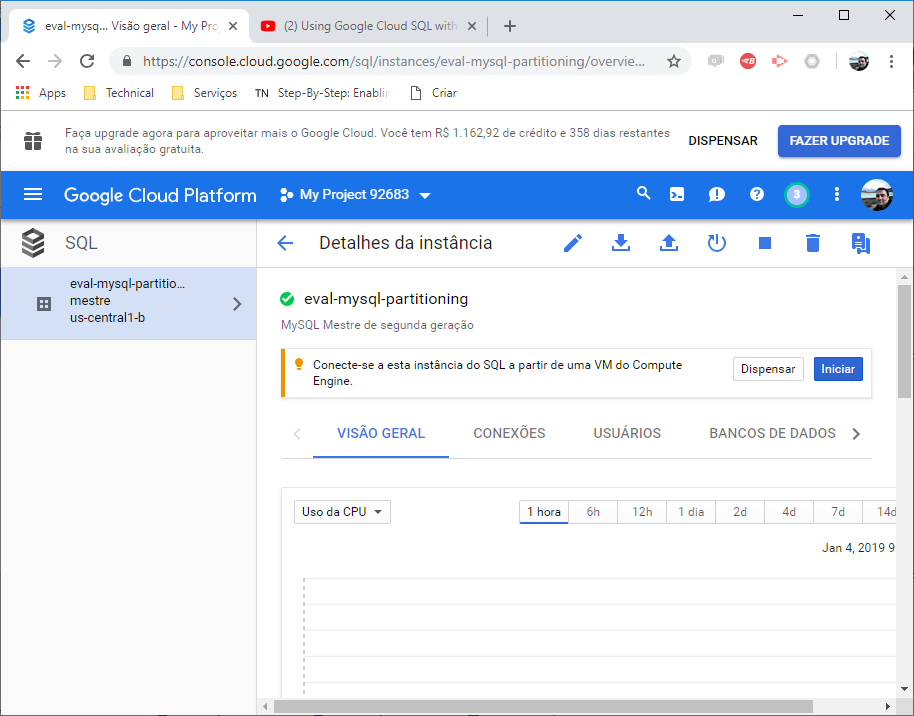
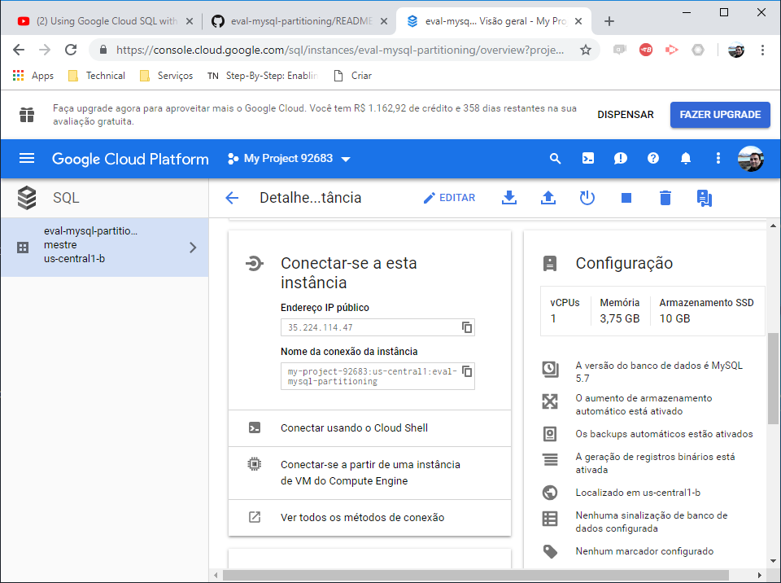

# README_GoogleCloudSQL_MySql

Assita ao vídeo:

* [Using Google Cloud SQL with Compute Engine](https://www.youtube.com/watch?v=mvIE8LkXEEY&feature=youtu.be)

Siga o Passo a Passo:

* Passo 1

* Passo 2

* Passo 3

* Passo 4

* Passo 5

* Passo 6

* Passo 7

* Passo 8

* Passo 9

* Passo 10

